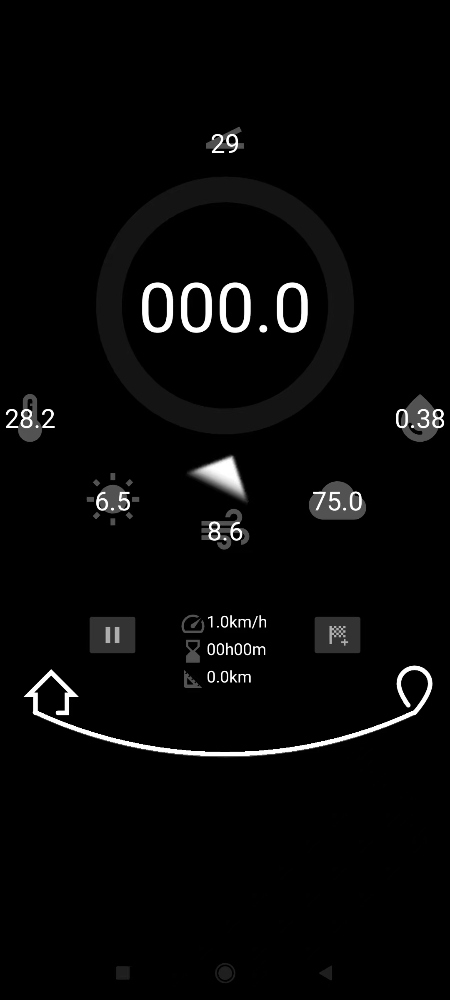

# Speed - 智能骑行码表

一个功能丰富的Android骑行码表应用，集成了GPS定位、传感器数据、天气信息和路径记录功能。

<table>
  <tr>
    <td style="width:400px; vertical-align:top;">
      
    </td>
    <td style="vertical-align:top; padding-left:20px;">
      <h3>核心功能</h3>
      <ul>
        <li><strong>实时速度监测</strong>: 基于GPS定位计算实时骑行速度</li>
        <li><strong>距离统计</strong>: 累计骑行距离计算</li>
        <li><strong>时间记录</strong>: 骑行时间统计和暂停功能</li>
        <li><strong>平均速度</strong>: 实时计算平均骑行速度</li>
      </ul>
      <h3>传感器集成</h3>
      <ul>
        <li><strong>坡度检测</strong>: 使用加速度计和磁力计计算骑行坡度</li>
        <li><strong>方向感知</strong>: 实时显示骑行方向</li>
        <li><strong>设备姿态</strong>: 监测设备倾斜角度</li>
      </ul>
      <h3>天气信息</h3>
      <ul>
        <li><strong>实时天气</strong>: 集成WeatherAPI获取当前位置天气</li>
        <li><strong>风速风向</strong>: 显示风速和风向信息</li>
        <li><strong>温度湿度</strong>: 当前温度和湿度数据</li>
        <li><strong>降水概率</strong>: 降雨概率和云量信息</li>
        <li><strong>UV指数</strong>: 紫外线强度指数</li>
        <li><strong>天气地图</strong>: 可查看详细天气地图</li>
      </ul>
      <h3>路径管理</h3>
      <ul>
        <li><strong>路标标记</strong>: 在骑行路径上添加标记点</li>
        <li><strong>路径可视化</strong>: 圆形路径显示骑行轨迹</li>
        <li><strong>分段统计</strong>: 各段路径的时间和距离统计</li>
        <li><strong>起点终点</strong>: 自动标记骑行起点和终点</li>
      </ul>
      <h3>用户界面</h3>
      <ul>
        <li><strong>圆形仪表盘</strong>: 美观的圆形速度显示界面</li>
        <li><strong>动态进度条</strong>: 实时显示骑行进度</li>
        <li><strong>多信息面板</strong>: 同时显示速度、天气、传感器数据</li>
        <li><strong>响应式设计</strong>: 适配不同屏幕尺寸</li>
      </ul>
    </td>
  </tr>
</table>

## 🛠️ 技术架构

### 开发环境
- **语言**: Java
- **平台**: Android (API 24+)
- **构建工具**: Gradle
- **最低SDK**: Android 7.0 (API 24)
- **目标SDK**: Android 14 (API 34)

### 核心技术栈
- **UI框架**: Android ConstraintLayout
- **网络请求**: Retrofit2 + Gson
- **传感器**: Android Sensor Framework
- **定位服务**: Android Location Services
- **自定义视图**: Canvas绘图

### 主要依赖
```gradle
implementation("com.squareup.retrofit2:retrofit:2.9.0")
implementation("com.squareup.retrofit2:converter-gson:2.9.0")
implementation("androidx.appcompat:appcompat")
implementation("androidx.constraintlayout:constraintlayout")
implementation("com.google.android.material:material")
```

## 📱 应用结构

### 核心类说明

#### MainActivity.java
- 主界面控制器
- 管理UI更新和用户交互
- 协调GPS、传感器和天气数据
- 处理路径标记和统计

#### LoListener.java
- GPS位置监听器
- 计算实时速度和距离
- 处理位置变化事件

#### MySensor.java
- 传感器数据管理
- 加速度计和磁力计数据处理
- 坡度计算算法

#### Flag.java
- 路径标记点类
- 管理标记点的位置和状态
- 处理标记点交互

#### WeatherApiService.java & WeatherResponse.java
- 天气API接口定义
- 天气数据模型
- 网络请求处理

#### DrawArcView.java
- 自定义圆形路径绘制视图
- 显示骑行轨迹

#### VisitWeatherMapActivity.java
- 天气地图查看界面
- WebView集成天气地图服务

### 布局文件
- `activity_main.xml`: 主界面布局
- `activity_visit_weather_map.xml`: 天气地图界面
- `put_flage_layout.xml`: 标记点布局
- `segment_data.xml`: 分段数据布局

## 🔧 安装和使用

### 系统要求
- Android 7.0 或更高版本
- GPS功能
- 网络连接（天气功能）
- 位置权限

### 权限说明
```xml
<uses-permission android:name="android.permission.ACCESS_COARSE_LOCATION" />
<uses-permission android:name="android.permission.ACCESS_FINE_LOCATION" />
<uses-permission android:name="android.permission.INTERNET" />
```

### 编译运行
1. 克隆项目到本地
2. 使用Android Studio打开项目
3. 连接Android设备或启动模拟器
4. 点击运行按钮编译安装

### 使用指南
1. **启动应用**: 打开应用后会自动请求位置权限
2. **开始骑行**: 点击开始按钮开始记录骑行数据
3. **添加标记**: 点击标记按钮在当前位置添加路径标记
4. **查看天气**: 点击天气图标查看详细天气信息
5. **暂停/继续**: 使用暂停按钮暂停或继续记录
6. **重置数据**: 使用重置按钮清除所有数据

## 🌟 特色功能

### 智能坡度检测
应用使用设备传感器实时计算骑行坡度，帮助骑行者了解路况。

### 实时天气集成
集成WeatherAPI服务，提供准确的实时天气信息，帮助骑行者规划路线。

### 可视化路径记录
独特的圆形路径显示方式，直观展示骑行轨迹和标记点。

### 多维度数据统计
同时显示速度、距离、时间、坡度、天气等多维度数据。

## 🔮 未来规划

- [ ] 支持多种运动模式（跑步、步行等）
- [ ] 添加社交功能，分享骑行记录
- [ ] 集成更多地图服务
- [ ] 添加语音播报功能
- [ ] 支持蓝牙设备连接
- [ ] 添加骑行路线规划

## 📄 许可证

本项目采用MIT许可证，详见LICENSE文件。

## 🤝 贡献

欢迎提交Issue和Pull Request来改进这个项目。

## 📞 联系方式

如有问题或建议，请通过GitHub Issues联系我们。

---

**注意**: 使用本应用时请确保遵守当地交通法规，注意骑行安全。 
